# Toolchain for Generating Right Leaning Identity Tangle Trees

[](https://doi.org/10.5281/zenodo.17612686)
[](https://www.gnu.org/licenses/gpl-3.0)

## Note to Reader

If you discover an issue with this repository or have a question, please feel free to open an issue.
I've included templates for the following issues:

- 🖋️ Spelling and Grammar: Found some language that is incorrect?
- 🤷 Clarity: Found a section that just makes no sense?
- ❓ Question: Do you have a general question?
- 🐞 Bug: Found an error in the code?
- 🚀 Enhancement: Have a suggestion for making the toolchain better?

## Cite Me 📃

BibTeX and APA on the right sidebar of GitHub.

## License ⚖️

GNU GPL v3

## Run the toolchain

Before running the toolchain ensure that you are running Linux and have the following installed:

1. [Rootless Docker](https://docs.docker.com/engine/security/rootless/)
2. [Just](https://github.com/casey/just)
3. [Git](https://git-scm.com/)
    - And clone the repository
4. [CMake](https://cmake.org/)
5. [uv](https://docs.astral.sh/uv/)
6. [GCC (or another c compiler, this should already be the case on Linux)](https://gcc.gnu.org/)
7. [MongoDB Compass (optional for viewing database)](https://www.mongodb.com/products/tools/compass)

Run the following command:

```sh
just go
```

This will run the following tasks:

1. Bootstrap the environment:
    1. Pull submodules
    2. Create a .venv
    3. Install requirements into .venv
2. Build documents
3. Build cython wrapper libraries
4. Build docker containers
5. Run docker compose playbook

## Planning and Administration

### Tasks

Tasks are tracked as GitHub issues, each `Enhancement` and `Bug` generating the following collection
of issues and child issues:

- A primary issue describing the goal.
- A documentation child issue.
- An implementation child issue.
- A validation child issue.

### Version control

The generator toolchain shall be kept under Git versioning. Development shall take place on branches
with `main` on GitHub as a source of truth. GitHub pull requests shall serve as the arbiter for
inclusion on main with the following quality gates:

- Compiling of source code.
- Running of and passing unit test suite.
- Running of and passing linting and style enforcers.
- Successful generation of documentation.

#### Release Tagging

The project shall be tagged when an `Enhancement` or `Bug` issue is merged into main. The tag shall
follow [semantic versioning](https://semver.org) for labels.

```
vMAJOR.MINOR.PATCH
```

### Project Structure

```

📁 .
├── 📁 docker
│   ├── 📁 prometheus_reporting
│   │   ├── 🐋 Dockerfile
│   │   └── 📄 prometheus.yml
│   ├── 🐋 docker-compose.yaml
│   └── 🐋 Dockerfile
├── 📁 docs
│   └── 📄 README.md
├── 📁 libraries
│   ├── 📁 core_lib
│   └── 📁 wrapper
│       ├── 📄 CMakeLists.txt
│       └── 🐍 py_comp_rlitt_pure_vignette.pyx
├── 📁 runner
│   ├── 📁 fproducer
│   │   ├── 🐍 __init__.py
│   │   └── 🐍 fproducer.py
│   ├── 📁 fworker
│   │   ├── 🐍 __init__.py
│   │   └── 🐍 fworker.py
│   ├── 📁 lib_wrapper
│   │   ├── 🐍 __init__.py
│   │   └── 🐍 lib_wrapper.py
│   ├── 🐍 __init__.py
│   ├── 🐍 __main__.py
│   ├── 🐍 config_store.py
│   └── 🐍 odm.py
├── 📄 CITATION
├── 📄 CMakeLists.txt
├── ❄️ flake.lock
├── ❄️ flake.nix
├── 📄 Justfile
├── 📄 LICENSE
├── 📄 mkdocs.yml
├── 🐍 requirements.txt
└── 📄 ruff.toml

```

#### Directories of interest

- Runner: This directory contains the Python modules defining producers and workers for Faktory.
- Docs: This directory contains the documentation for the toolchain.
- Docker: This directory contains the dockerfiles and Docker Compose playbooks for the toolchain.
- Libraries: This directory contains a git submodule copy of the Core Libraries.

### Define a unit

A unit in this project shall be defined as a Python module.

### Quality

The toolchain shall fail safe, that is the toolchain can fail but the failure must be detectable.

#### Unit testing

Each Python module shall be unit tested.

#### Integration testing

Integration testing shall be carried out by a bench test of the Docker Compose playbook.

<!-- prettier-ignore-start -->

### Requirements

#### Functional Requirements

The serving and maintenance of a distributed job queue is a solved problem with a number of
off-the-shelf products available. We shall adopt the
[Faktory](https://github.com/contribsys/faktory) system in this toolchain.

##### Use Cases

Functional requirements for the toolchain are phrased as use cases which can be seen in the sidebar.
The following use case diagram models the interdependence of those use cases.

```mermaid

flowchart LR
  aS["👤 Start Up"]
  aJ["👤 Faktory Worker"]
  LH(["Load Job Queue"])
  PG(["Pageinate Collection"])
  MC(["Enqueue Job"])
  RP(["Retrieve Page"])
  GP(["Compute on Page"])
  PJ(["Process Job"])
  UC(["Insert Tangle Into Collection"])
    LH -. include .-> PG
    LH -. include .-> MC
    aS --> LH
    aJ --> PJ
    PJ -. include .->  RP
    PJ -. include .->  GP
    PJ -. include .->  UC
```



- [Load Job Queue](./use-cases/load_job_queue.md)
- [Enqueue Job](./use-cases/enqueue_job.md)
- [Paginate Collection](./use-cases/pageinate_collection.md)
- [Process Job](./use-cases/process_job.md)
- [Retrieve Page](./use-cases/retrieve_page.md)
- [Compute on Page](./use-cases/compute_page.md)
- [Insert Tangle Into Collection](./use-cases/insert_tangle_into_collection.md)

#### Non-Functional Requirements

<!-- prettier-ignore-start -->
!!! requirement-card "Two click deployment"
    The toolchain shall be deployable with as few clicks as possible. 
<!-- prettier-ignore-end -->

### Technologies

#### Languages/Frameworks

- Python
- pyfaktory
- cython

##### Style Guide

The python portions of the toolchain shall adhere to the configured ruff format and check settings.

#### Tools

- ruff
- uv
- nix
- mkdocs
- docker
- cmake
- docker compose
- Faktory
- prometheus

## Design and Documentation

### System

The following block diagram describes the python portion of the toolchain. Full unit descriptions
are found in the sidebar.


### Units

- [Typer Entry point](./unit-descriptions/entrypoint.md)
- [Configuration Handler](./unit-descriptions/config.md)
- [Faktory Worker](./unit-descriptions/worker.md)
- [Faktory Producer](./unit-descriptions/producer.md)
- [Cython Wrapper](./unit-descriptions/wrapper.md)
- [MongoDB ODM](./unit-descriptions/odm.md)
