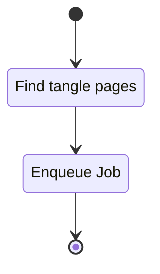

# Producer Mode

## Description

This unit describes the functionality for the producer mode. When running we expect a single
instance of the producer to run.

### Public Interfaces

#### Faktory Producer

The Faktory producer interface serves as the primary entry point for producer mode. The interface
implements the job production state machine found in the README.

### Private interface

#### Produce Jobs

##### State machine

## Unit test description

Unit test description is problematic without a unit test framework.

## Implementation

<!-- prettier-ignore-start -->
::: runner.fproducer.fproducer
    :docstring: 
    :members:

<!-- prettier-ignore-end -->
