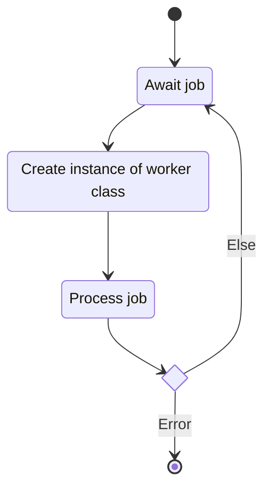
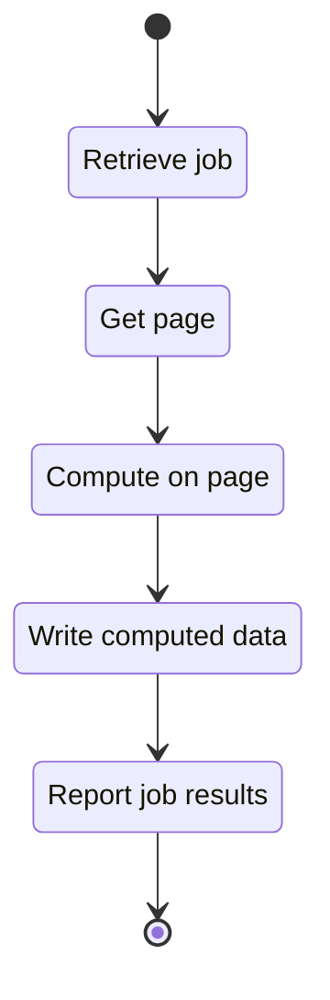

# Worker Mode

## Description

This unit describes the functionality for the system's worker mode. When running we expect $n$
instances of the worker to run simultaneously.

### Public Interfaces

#### Faktory Worker

The Faktory worker interface serves as the primary entry point for worker mode. The interface
retrieves and processes tangle generation jobs distributed by Faktory.

##### State Machine

### Private interface

#### Class Worker

The worker class describes the data and methods needed for an atomic generation job.

##### Process Job

The process job method contains the core logic of the worker class. The method connects to the
MongoDB tangle collection and retrieves the page pointed to by the job data. The method then calls
the low-level computation code to compute new tangle data from the pages.

###### State Machine

## Unit test description

### Process Job

Unit test description is problematic without a unit test framework.

<!-- prettier-ignore-start -->

## Implementation

<!-- prettier-ignore-start -->
::: runner.fworker.fworker
    :docstring: 
    :members:

<!-- prettier-ignore-end -->
